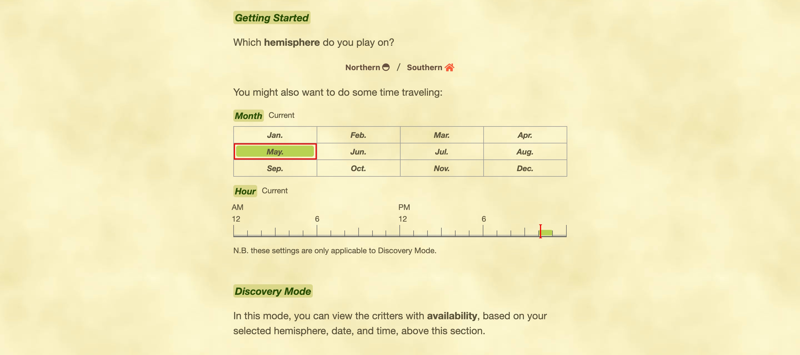
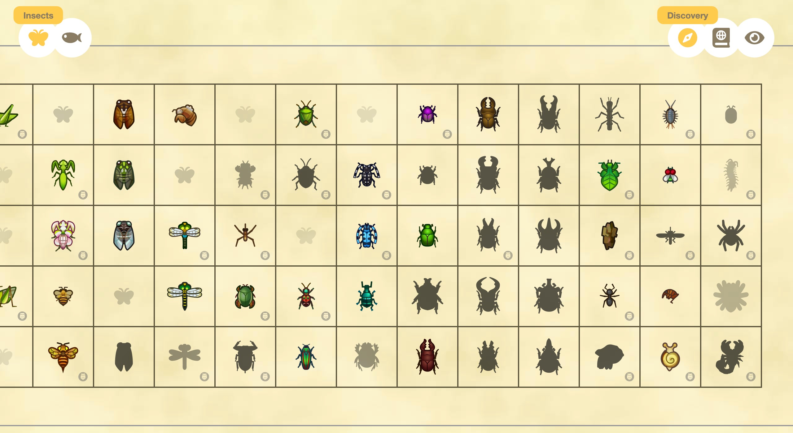
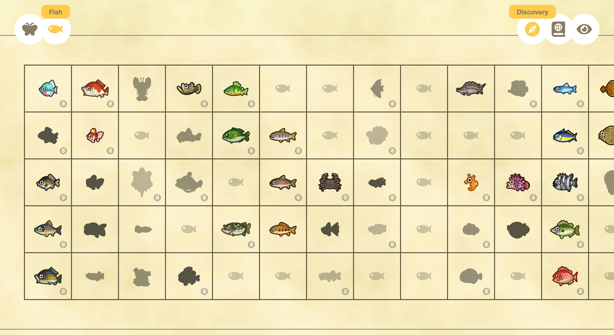
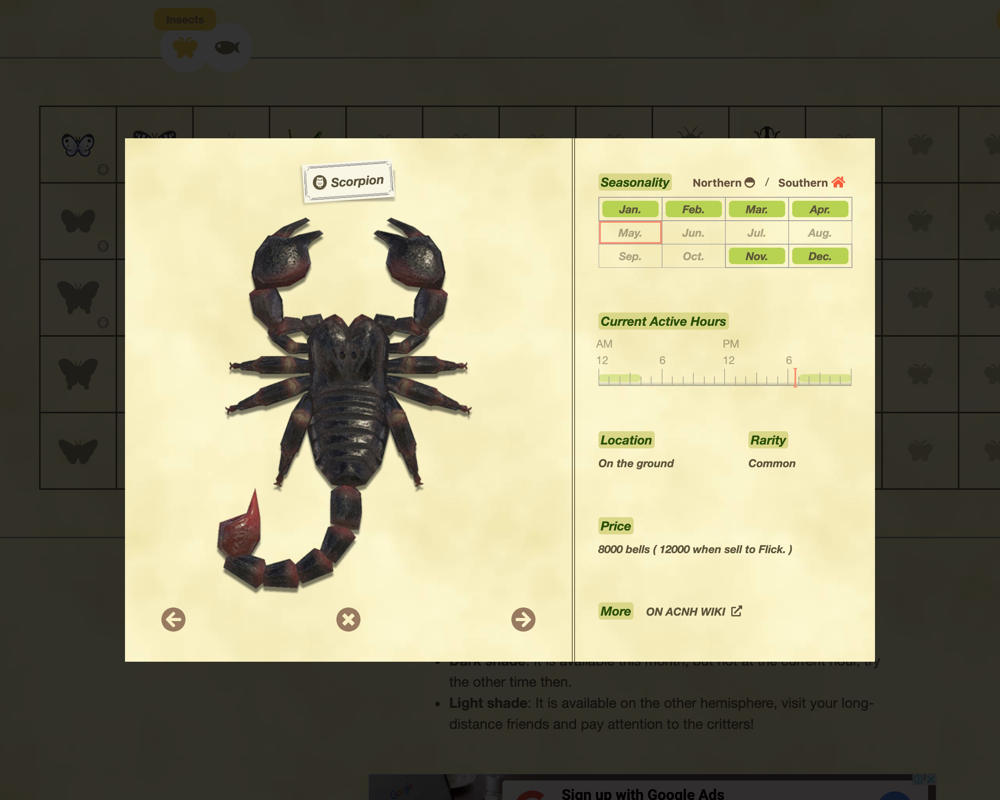
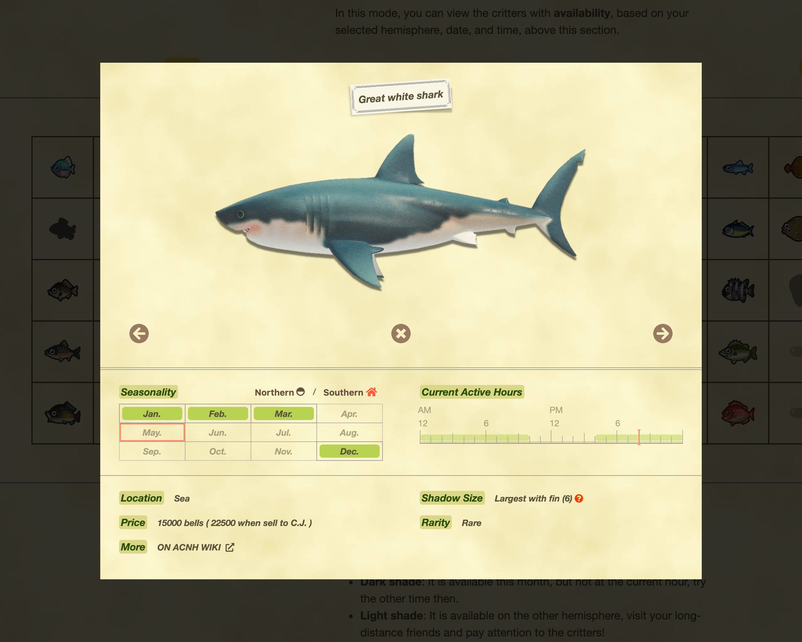
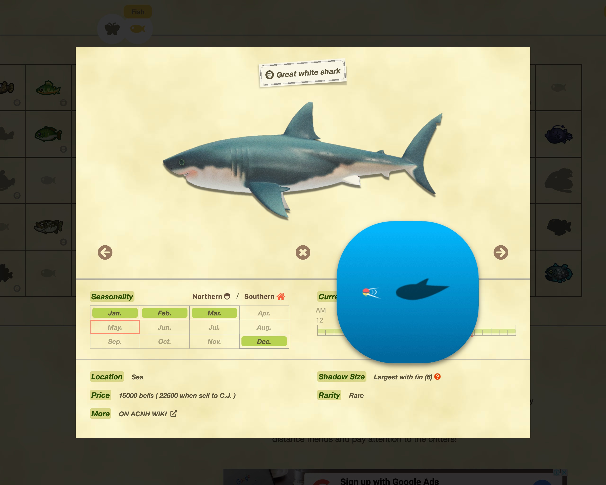

# Critterpedia-plus

An advanced critterpedia for Animal Crossing: New Horizons, helps you find new critters easily.

## Screenshots

The time traveling filters, allow you to inspect critters' availabilities now and then.

Display the critters with game interface, helps you easily to finish your collection.

More details than in game view.

Shadow preview provides more intuitive idea what it looks like.

Visit the live site for more fun here:
https://mutoo.github.io/critterpedia-plus/

## License

MIT

## Credits

This project is based on [react-boilerplate v5.0](https://github.com/react-boilerplate/react-boilerplate/pull/2815).

I want to thank [ACNH API](https://acnhapi.com/), [ACNHCDN](https://acnhcdn.com) and [ACNH Spreedsheet](https://docs.google.com/spreadsheets/d/13d_LAJPlxMa_DubPTuirkIV4DERBMXbrWQsmSh8ReK4/edit) which provide a very easy way to access game data for this project.
