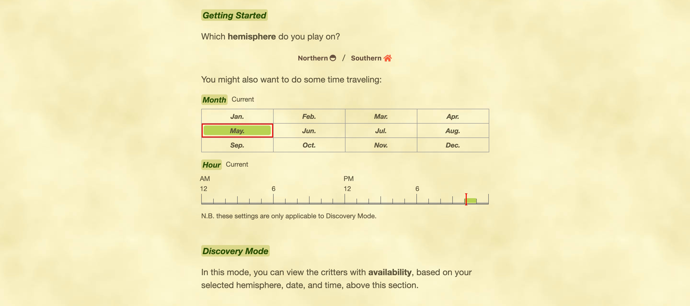
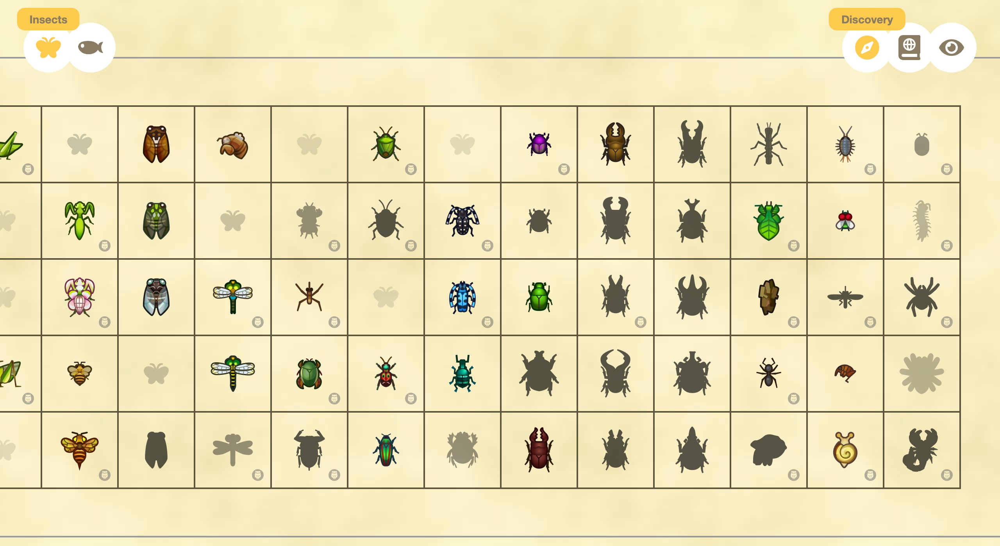
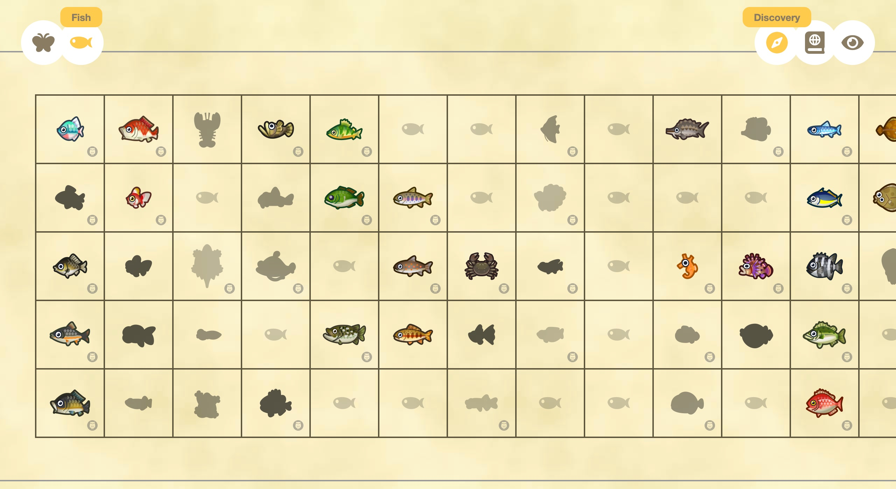
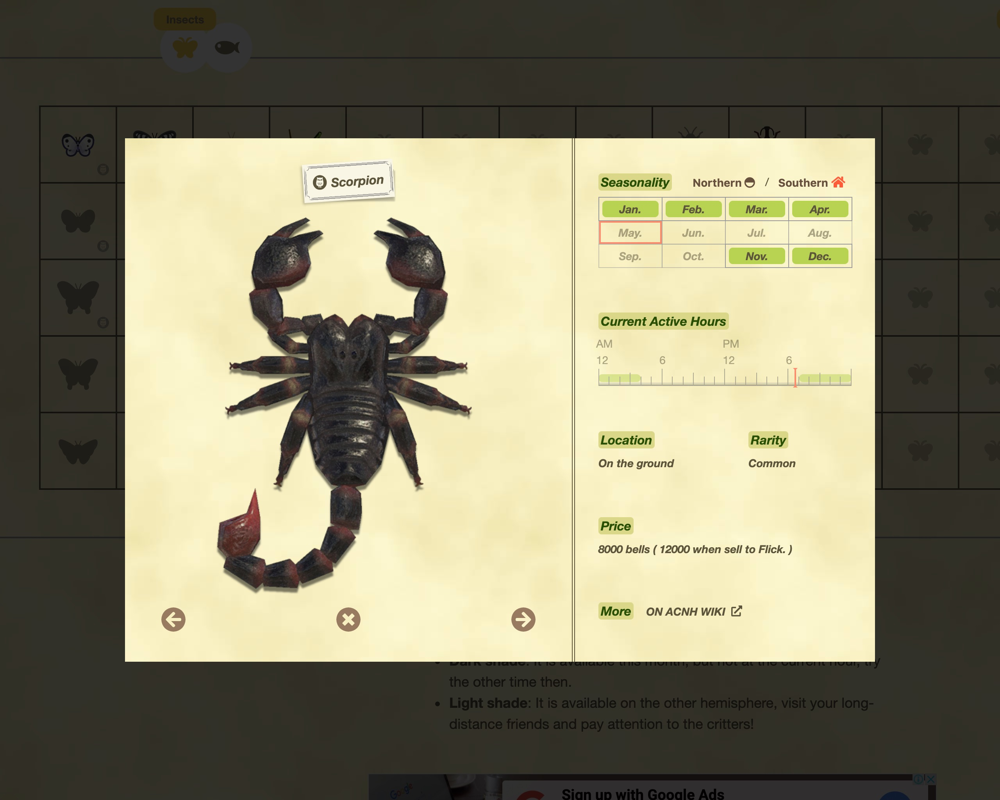
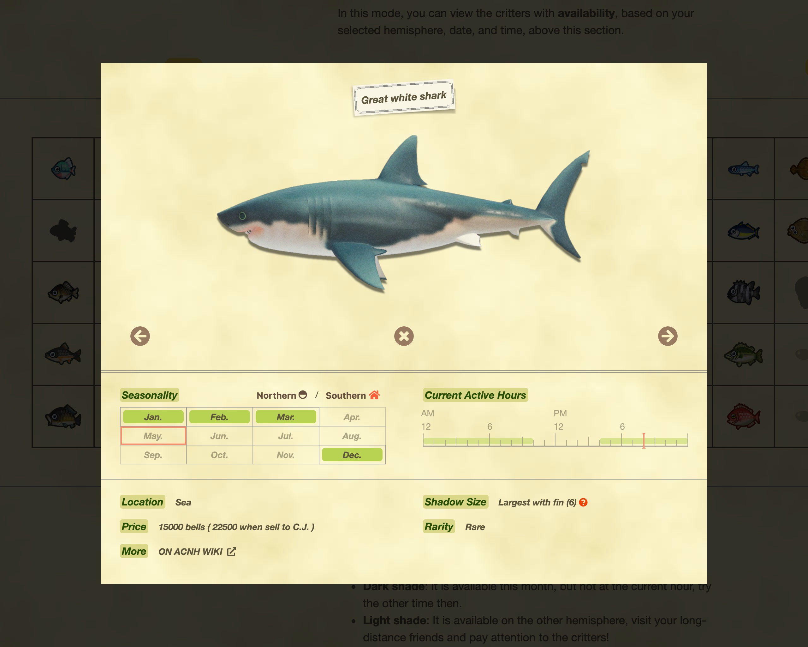
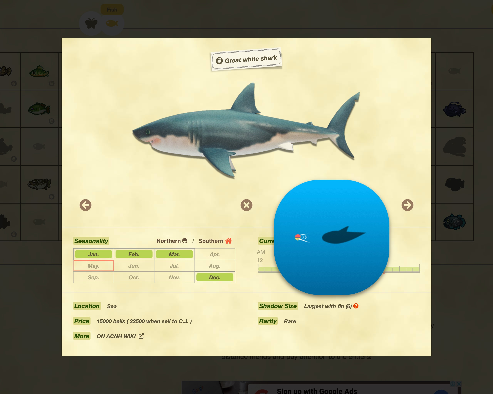

# Critterpedia Plus

An advanced Critterpedia for Animal Crossing: New Horizons that helps you find new critters easily.

## Screenshots

The time-traveling filters let you inspect critter availability now and later.

Display critters in a game-like interface to help you finish your collection more easily.

More detail than the in-game view.

The shadow preview gives you a more intuitive idea of what it looks like.

Visit the live site here:
https://mutoo.github.io/critterpedia-plus/

## License

MIT

## Credits

This project is based on [react-boilerplate v5.0](https://github.com/react-boilerplate/react-boilerplate/pull/2815).

I want to thank [ACNH API](https://acnhapi.com/), [ACNHCDN](https://acnhcdn.com), and the [ACNH Spreadsheet](https://docs.google.com/spreadsheets/d/13d_LAJPlxMa_DubPTuirkIV4DERBMXbrWQsmSh8ReK4/edit), which provide easy access to game data for this project.
